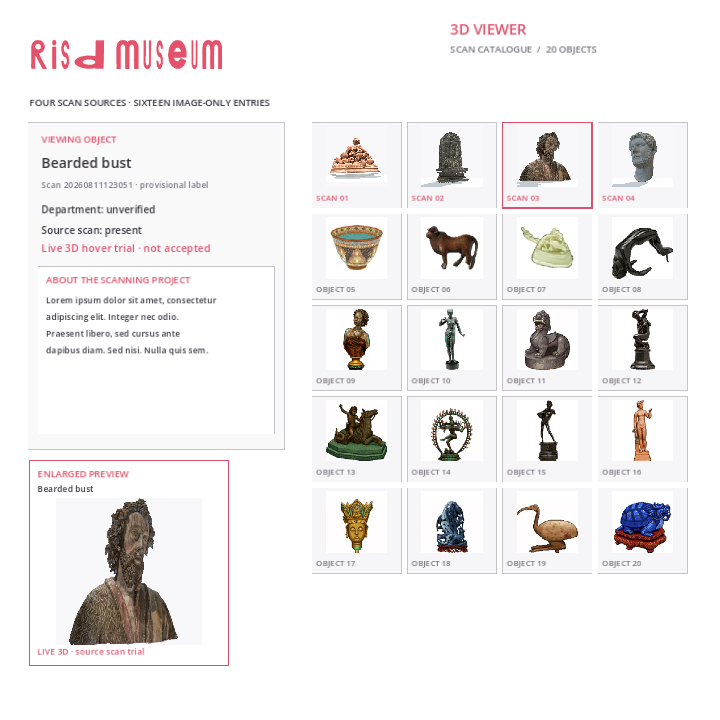
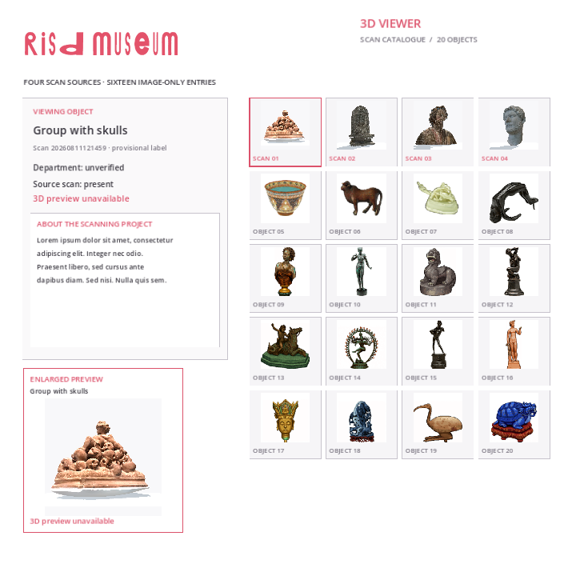

# #154 source-preserving fallback verification

28 September 2026. Isolated branch `Reid-Surmeier/scan-source-fallback-154`, based on `50f67511f6c8c41a34afe7cba8315f47b2f509bb`. No build branch, original scan, chosen GLB, catalogue implementation, or accepted runtime asset changed. Spend: USD 0; no generation provider used.

The bounded result is a new native/Web evidence packet for the existing one-scan prototype, not a mesh repair or acceptance of four live scans. The bearded scan appears at six fixed angles; the other three scans retain their exact static source thumbnails and explicit unavailable state. **Fresh independent image-only verdict: bearded live preview FAIL; three pictured unavailable states PASS.** [Exact external GPT-6 Astra medium verdict](blind-review.md), supplied through the coordinating agent, is preserved verbatim. No code, logs, prior verdict or report was supplied to that reviewer.





## Source integrity and repair decision

`python3 docs/research/scan-fallback-154/check_sources.py` passed: all twelve local OBJ/MTL/JPG hashes and all four selected GLB hashes match their original manifests. The script checks the explicit rerun selection for the group and the `prototype` selection for the pale bust, and verifies the copied bearded GLB. It reads only the source files.

| Scan | Selected GLB SHA-256 | This trial |
| --- | --- | --- |
| 20260811121459 | `86c2c80bc05489b12bec1a03216d8765c66baaf3f8f89cf1f018004cba152193` | Static thumbnail; 3D unavailable |
| 20260811122415 | `da7480355f1c384ed8588e44cd2f1bf9c666d03c2bd7a9017f958f3d5ee08a41` | Static thumbnail; 3D unavailable |
| 20260811123051 | `faaece8dd2b1b25f6d2a7d96671db37ea810ede3bdc5441099f18f96ffc50d74` | Existing opaque, source-textured preview trial |
| 20260820133334 | `94e634a0554b6925fe26be4bbe5b3df2e53a19088883e733f4f9bcffed626d9e` | Static thumbnail; 3D unavailable |

The earlier [unreduced source and topology investigation](https://github.com/Reid-Surmeier/risd-godot/blob/e7586320/docs/research/proton-scan-validation.md) already tested source-preserving seam welding, opaque materials and unreduced geometry. Its source comparisons retain the relief pedestal gaps and pale rear mass. The [group component removal probe](https://github.com/Reid-Surmeier/risd-godot/blob/82cf74e9/docs/research/proton-scan-validation.md) left a jagged strip. The incomplete `891d6bf9` floor experiment raises the display floor to Y=0.43; that hides geometry and is not a source repair. No new source-backed deletion, filling, recoloring or reconstruction follows from the available data, so none was attempted here.

This fallback preserves the visible limitations and provisional identity. It does not resolve #154's four-live-scan objective, and the issue must remain open. Further reconstruction requires raw/calibrated coverage of the disputed bases and rear surfaces sufficient to distinguish physical object geometry from scan errors.

### Proportion diagnosis after the blind review

The reviewer reported a narrower, elongated bearded preview versus the original source captures. The reused `catalogue.gd` creates a `550 × 392` SubViewport in `_build_scan_preview`, but `_draw_hover` assigns all scan previews aspect `1.0` and stretches the whole texture into a square. That makes the horizontal-to-vertical scale `392 / 550 = 0.712727`, a 28.7% horizontal compression. This is a concrete presentation mismatch; the copied GLB's matching hash rules out this trial having deformed its mesh. A square viewport or aspect-preserving display rectangle can test the correction without changing geometry or texture.

The visible hair openings also occur in the unreduced source views supplied to the reviewer. The earlier source investigation records 8,039 open edges and near-collapsed UV faces in that source. These files do not supply missing scalp/curl surfaces or calibrated views that justify reconstructing them; filling them automatically would invent scan data. Correcting presentation therefore cannot establish acceptance under the requested hole-free live-asset criterion. #154 and #157 remain open.

## Exact visual packet

`native/` and `browser/` each contain 18 full-page PNGs: 720 and 1600 square, nine cases each. Filenames use case indexes:

| Index | Case |
| --- | --- |
| 00–05 | Bearded camera yaw 0°, 60°, 120°, 180°, 240°, 300° |
| 06 | Group static preview |
| 07 | Relief static preview |
| 08 | Pale bust static preview |

The [capture harness](../../../modules/sculpture_viewer/prototype_154/capture.gd) instantiates the existing catalogue with the same assets, lighting, material override, camera and layout. It disables automatic rotation/input solely to pin matching views, and asserts that the three unavailable cases disable the scan renderer. It creates no geometry and does not modify source pixels. Native captures use Godot 4.7.2 Compatibility on Mesa llvmpipe. Web captures use its release export in Chrome/SwiftShader. The [browser result](browser/result.json) records both sizes, six angles, three unavailable states and zero page errors.

The unchanged catalogue SHA-256 is `46ac8740ba0d39f1a1abbc807e2aaf6fce98f3b6a380cbb69c3cc6dd8524baaa`. The executed capture script SHA-256 is `511af7d012e43a99ea60d6c2cbca23daf585355999b34a97a214da46090614e2`. The exported diagnostic pack SHA-256 is `36771390e64cba020ebe93e4f74318f5c9b8b80d273c5232f06d5cfa3b257026`. The screenshot manifest pins every reviewed image.

Both native runs printed `PASS: six native angles and three unavailable states`. Web completed all 18 captures with an empty page-error list. `scripts/check.sh` passed after fresh resource import; it reported 13 ObjectDB instances leaked at exit. `git diff --check` passed. These are execution and provenance checks, not substitutes for the visual verdict.

This is an isolated catalogue/asset export, not the full game: it does not establish full-Shell loading speed, real hover, zoom, drag or runtime integration. The prior [#157 trial](../../../modules/sculpture_viewer/prototype_157/RESULT.md) retains its separately scoped input evidence. No new full-module input playtest was needed because this work changes only diagnostic files and evidence.

## Reproduce

From this worktree root, create a disposable small Godot project. Copying avoids mutating the original imports or another worktree's cache.

```bash
scan_project=$(mktemp -d /tmp/scan-fallback-154-XXXXXX)
mkdir -p "$scan_project/modules/sculpture_viewer/assets" "$scan_project/modules/sculpture_viewer/prototype_157" "$scan_project/web"
cp docs/research/scan-fallback-154/project.cfg "$scan_project/project.godot"
cp docs/research/scan-fallback-154/export_presets.cfg docs/research/scan-fallback-154/capture.tscn "$scan_project/"
cp modules/sculpture_viewer/prototype_154/capture.gd "$scan_project/"
cp modules/sculpture_viewer/catalogue.gd "$scan_project/modules/sculpture_viewer/"
cp -a modules/sculpture_viewer/assets/scans modules/sculpture_viewer/assets/setup "$scan_project/modules/sculpture_viewer/assets/"
cp modules/sculpture_viewer/prototype_157/bearded-candidate.glb "$scan_project/modules/sculpture_viewer/prototype_157/"
godot --headless --editor --import --path "$scan_project"
godot --headless --path "$scan_project" --export-release Web "$scan_project/web/index.html"
```

Run native twice, changing final `720` to `1600`; use a fresh output folder to preserve this packet:

```bash
env -u WAYLAND_DISPLAY DISPLAY=:99 godot --display-driver x11 --rendering-method gl_compatibility --path "$scan_project" -- /tmp/scan154-new-native 720
```

Serve the exported `web/` folder with a local diagnostic HTTP server, then run `PLAYWRIGHT_MODULE=/absolute/path/to/playwright/index.mjs node docs/research/scan-fallback-154/browser.mjs URL /tmp/scan154-new-browser`. The script captures both sizes sequentially and closes Chrome. Coordinate the rendering window with other agents; these are software-rendered observations, not a timing benchmark.
