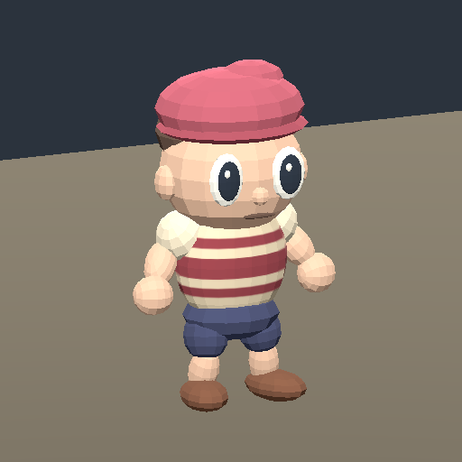
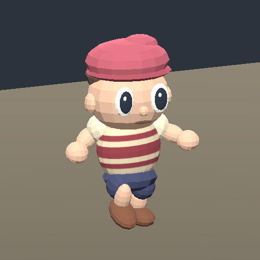

# THROWAWAY native Godot fixture proof — issue 230

Run `python3 image-work/character-fixture/godot-proof/run.py` from the worktree. It imports the neighboring GLB into a temporary Godot project, evaluates real Idle/Walking_A clips, writes captures and checks one authored footstep method key. Requires the existing Godot binary and native X11 display; no install, production project import or runtime edit.

Verified on September 30, 2026: Godot 4.7.2, Compatibility with Mesa llvmpipe/OpenGL ES 3.2. The imported skeleton has 41 bones and 76 clips. Idle and Walking_A each last 1.0416666 s in this export. Playing/evaluating walk changes the left foot transform and differs from idle. The baked striped shirt is visible in both inspected captures.

The study adds exactly one method key at 0.3333 s to a duplicated non-looping walk. It emits a one-shot CPUParticles3D burst near the shoe; `dust.png` visibly shows the pale burst. Playing the remainder and then idle leaves the call count at 1. `dust-control.png` is the near-matched pose before emission. This is an authored event demonstration, not a verified physical contact detector, foot grounding, controller, blend tree or production effects system.

`evidence.json` records measured results and fixture hash. `proof.gd` contains runnable assertions; `run.py` fails if expected evidence is absent. Import/render logs are real command output. Source fixture is the existing authored visitor, not the new horned character. Cost $0; browser rendering and gameplay contact quality remain untested; visual selection remains pending.
