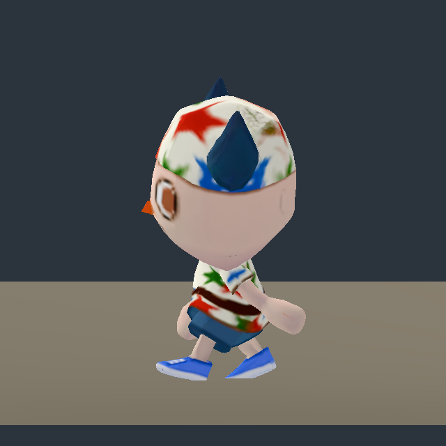

# Raw provider motion proof — issue 230

**Import works; the raw animation library fails scale and floor-contact gates.** These captures preserve the provider output before any animation correction or Blender rebake. The clip GLBs were not edited. No target-body or weight acceptance is inferred.

Run `python3 image-work/character-pilot/godot-proof/run.py`. It uses existing Godot/FFmpeg binaries, a temporary project and native X11 display. It leaves no production import metadata or runtime scene edits.

## Measured native results

Godot 4.7.2 imported each GLB with one visible `char1` mesh and 24 skeleton bones. The clip files contain no visible extra helper mesh. The names, parents and rest transforms match across idle/walk. Imported skeleton/mesh object scale is 0.01 in both. The review keeps that scale and uses one camera and one fixed floor from the idle mesh's evaluated rest bounds; no per-clip size correction or foot solver is applied.

| Property | Raw idle | Raw walk |
| --- | --- | --- |
| Imported animation | `Armature\|Idle\|baselayer` | `Armature\|walking_man\|baselayer` |
| Length | 4.0333333 s | 1.0666667 s |
| Rest mesh height | 1.898034 m | 1.898034 m |
| Animated Hips local scale | 1.176471 | 1.0 |
| Evaluated height, eight sampled poses | 2.065–2.205 m | 1.821–1.889 m |
| Minimum mesh position relative to review floor | -0.0013 to +0.0063 m | -0.0605 to -0.0362 m |

**The idle scale track adds 17.6471% at Hips and propagates to Head.** Matching bone rests do not make these raw clips interchangeable at stable size. Walk's evaluated geometry penetrates the review floor by approximately **3.6–6.0 cm** across the sampled poses. The floor is already 1.5 cm below the rest sole plane; this is not a passed grounding result. Measurement uses CPU-skinned vertices with current bone poses and inverse-bind transforms, not only ankle coordinates. No controller/world-space stance drift was tested.

The left foot transform changes in both clips; walk's eight samples show alternating articulated foot motion. That is evidence of real skeletal animation, not proof of a good gait. A clip containing animated bones can still fail scale, stance and visual checks.

## Visual inspection

Inspected idle start/mid, walk 0/2/4/6 and profile. The horned hat, face and textured shirt survive import and articulate with the body. Raw idle visibly enlarges the character relative to walk under the shared camera. The waist/shorts tilt strongly during the walk; the very short limbs and large head make the resulting gait read as a small generic humanoid animation, whose suitability remains an owner choice. Profile shows the leg swing and toe tilt.

No grossly detached shoulder, elbow, hip or knee surface was apparent in the inspected samples. That limited observation does not certify weights: the shirt/shorts conceal joint transitions, the hands have simple mitten-like geometry, and only one clip plus eight walk phases was studied. No shoulder lift, deep elbow/knee bend, crouch or upper-body interaction deformation test was performed. The visible shoe positions and measured floor penetration remain unresolved motion failures.

[Eight sampled walk frames as a film](walk-sampled.mp4). This is one approximately 1.067 s cycle sampled at 7.5 poses/s and encoded at 30 fps by repeating frames; it is not a continuous 30 fps gameplay recording.

`evidence.json` records full bone rests, sample times, foot positions, pose scales, skinned bounds and input hashes; `proof.gd` is runnable source with assertions. Logs are actual native import/render output. Provider generation spend is documented by the parent pilot, and this verification adds $0. Browser performance, shared-clip blending, foot contact, corrected clips and final visual selection are unpassed or untested. A derived normalized proof must live separately and retain this raw evidence.

Separate after-proof: [derived scale normalization and bake](normalized/README.md). The raw frames, measurements and film above remain unchanged.
