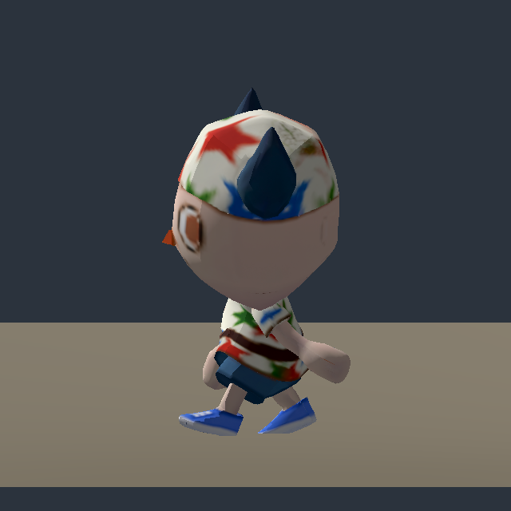

# Derived idle scale repair — native after-proof

**The Hips scale mismatch is repaired; grounding still fails.** This study imports `target-baked-normalized-idle.glb` without touching raw provider files or before evidence. Blender's saved normalization record describes changing only the derived idle Hips scale curves to 1; its bake record describes the separate 512² color/material repair.

Reproduce: `python3 image-work/character-pilot/godot-proof/derived_run.py image-work/character-pilot/target-baked-normalized-idle.glb`. The runner creates an isolated Godot project, retains the before camera/skin measurement method, selects the combined `idle` and `walk` clips and writes this separate folder. Cost $0; no runtime integration.

Godot 4.7.2 imports 24 bones and four animations: base, idle, run and walk. Idle and walk both have Hips local scale 1.0, and Head no longer inherits the raw idle's 17.6471% scale inflation. Rest skinned height remains 1.898034 m. The 512² baked color texture is visible with the derived matte/lit material, in contrast to the raw metallic/emissive material.

| Measured result, eight poses | Derived idle | Derived walk |
| --- | --- | --- |
| Duration | 4.0333333 s | 1.0666667 s |
| Evaluated height | 1.755–1.874 m | 1.821–1.889 m |
| Lowest vertex height vs review floor | +8.3 to +9.3 cm | -6.0 to -3.6 cm |
| Lowest vertex height vs rest sole plane | +6.8 to +7.8 cm | -7.5 to -5.1 cm |

The review floor is 1.5 cm below the rest sole plane. **Normalized idle floats approximately 7 cm; walk still penetrates.** A scale repair does not replace clip/contact calibration. The rest pose, clothes and shoes remain visible; no gross joint detachment was apparent in these limited native samples. Shoulders/knees are partly concealed by clothes, and bend/extreme-pose acceptance remains untested.

The final export preserves fractional key times with `export_force_sampling=False`. Native Godot durations match the raw imports exactly at its float precision: idle 4.0333333015 s and walk 1.0666667223 s; recorded differences are zero. The scale gate passes all sixteen sampled idle/walk Hips poses. This repair preserves clip timing while leaving grounding and loop/blend acceptance unresolved.

Verified normalized source SHA-256: `9d566ae7413d209f9986b1ff53d486ba3535a59f498d686f169d7257e21cc804`.

Before: [raw idle](../idle.png), [raw walking](../walk-04.png). After, with the same camera and floor:

[Sampled derived walk film](walk-sampled.mp4). Eight evaluated poses encoded as repeated frames, not a continuous gameplay recording. `evidence.json` records source hash, pose scales, bone rests, clip lengths, feet and actual skinned bounds. `proof.gd` is the generated runnable proof, and logs preserve real command output. Provider generation spend remains in the parent pilot's ledger. Browser, controller, contact solver and owner visual acceptance remain unpassed or untested.
