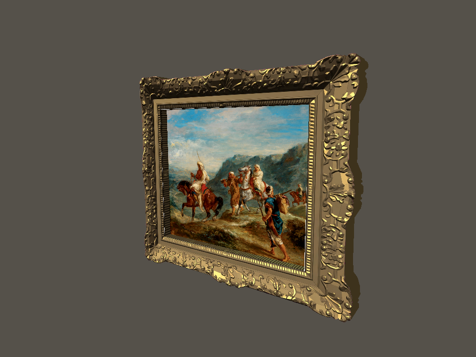

# Collection frame trial — #183



One Muse edit of the real frame surrounding Delacroix's *Arabs Traveling*
(35.786), using the unchanged final Grand Gallery frame prompt. The authentic
museum painting remains a separate image, mapped at 0.651 × 0.541 metres.

The trial renders on the RTX 4070 SUPER through WSL's D3D12 OpenGL adapter.
It reuses the existing frame front, inset and canvas geometry. In this isolated
trial, the shaped frame's outline is extruded for its sides; the old rectangular
side strips left floating fragments. The 9 cm depth remains a reused convention,
not a measured frame profile. The side is a plain material awaiting texture/bake
work. Ornament fidelity, UV2 room lighting and browser integration are unverified.
No production or batch acceptance is implied.

Source: `references/rectified-source.png`; Muse input: `references/frame-photo.png`;
provider result: `trial/muse-original.webp`; keyed texture: `trial/frame.png`;
geometry: `trial/geometry.json`; review/hashes: `review.json`.
The original video frame was decoded with CUDA; `source.json` records its hash
and canvas homography. The rectification doesn't flatten protruding carvings.

One OpenRouter `meta/muse-image` request returned one image, actual recorded cost
$0.010000. The run also retains `spendState: unknown` and `retryState: never-resubmit`;
it must not be resubmitted. The full receipt and reservation/event records are in
[`muse-frame-run.tar.gz`](../../docs/evidence/collection-reconstruction/muse-frame-run.tar.gz).
Initial planning of the tight crop spent nothing; `recipe-full-frame.json` and
objective `muse-18b8dc5bd497a903bc3d` are the executed full-outline revision.

```sh
env -u LIBGL_ALWAYS_SOFTWARE DISPLAY=:0 GALLIUM_DRIVER=d3d12 MESA_D3D12_DEFAULT_ADAPTER_NAME=NVIDIA godot --path . --rendering-method gl_compatibility --script res://modules/shell/prototype/collection_reconstruction/frame_trial.gd
```

This exports detail, oblique and 2.5 m viewing-distance evidence. These are isolated
asset renders, not the finished room or a completed museum walk.
