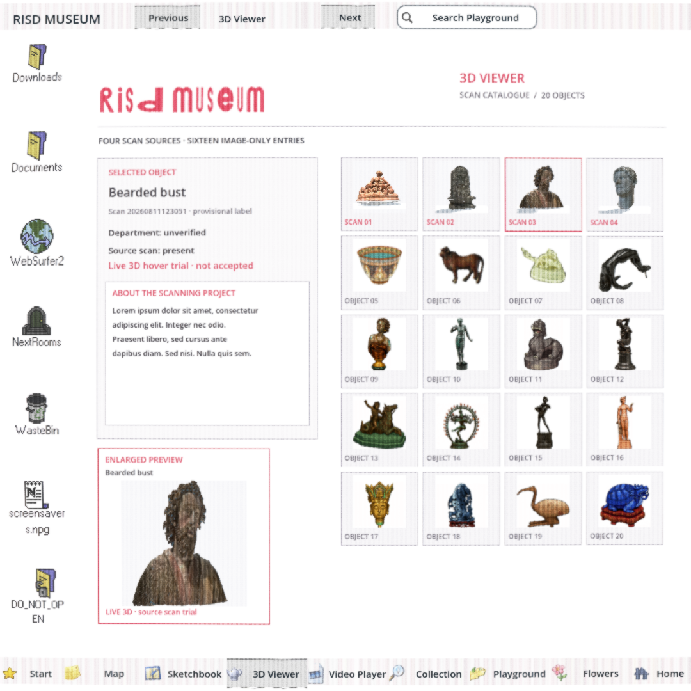

# #157 one-scan live-hover trial — partial result

Question: does the source-backed bearded GLB remain readable when it replaces its static thumbnail in the square Viewer's lower-left hover preview, without disturbing the twenty-card catalogue?

**Yes, for this one scan at the tested native preview size.** This is a throwaway branch based on the accepted square build; it does not close #157 or make any scan a shipped runtime asset. Only card 03 loads a GLB. Cards 01, 02 and 04 remain honest static thumbnails with 3D unavailable, and all sixteen other cards stay image-only. Selection, provisional name and unverified department still use the existing catalogue. The live preview is explicitly labeled a trial.

The candidate is the hash-checked 120k-face Proton conversion recorded in [#154 at `e7586320`](https://github.com/Reid-Surmeier/risd-godot/blob/e7586320/docs/research/proton-scan-validation.md). This branch copies its GLB byte-for-byte (SHA-256 `faaece8dd2b1b25f6d2a7d96671db37ea810ede3bdc5441099f18f96ffc50d74`). An opaque material keeps its embedded source texture; no geometry, UV, or source pixel was synthesized. The preview uses the model's recorded center and the existing catalogue's lower-left space, rotates while card 03 is hovered, and disables its offscreen renderer when the hover or Page visibility ends.

[Six native square angles](evidence/risd-viewer-157-180.png): `000`, `060`, `120`, `180`, `240`, `300` PNGs in `evidence/`. A fresh GPT-6 Astra medium image-only reviewer saw only these captures, the full square Page, and Buddha reference captures. Verdict: **PASS for the one-scan hover visual trial**. The enlarged view makes face/beard/clothing more legible than the small card. All six angles read as one coherent bust; the rear hair and lower cut edge are rough, and the crown/hem have tight margins. The reviewer found no label collision or regression to the other cards/wordmark; the provisional/unverified/not-accepted labels are truthful. Reviewer made no browser, actual-hover, drag or zoom claim.

Native `scripts/playtest.sh sculpture_viewer` passed seven Tabs, twenty real card clicks, hover, hidden freeze/input and return; its selected-02 screenshot above shows the trial in the real 1080-square Shell. The separate six-angle native capture passed, including assertions that the scan renderer stops while hidden and resumes when visible. `scripts/check.sh` and `git diff --check` pass. Godot exported a Web Game `.pck` to `/tmp/risd-prototype-157.game.pck` with exit 0, but no exported-browser interaction or timing proof was made.

Still open before #157 can close: full-orbit/zoom acceptance and safe import for the other three scan-backed cards (#154); verified descriptions and departments where records exist (#169); browser hover/rotation performance; selection into a larger inspectable 3D view; final independent review of the complete Viewer. The two RISD matches researched in #169 are not silently assigned in this prototype. No paid generation; USD 0.
